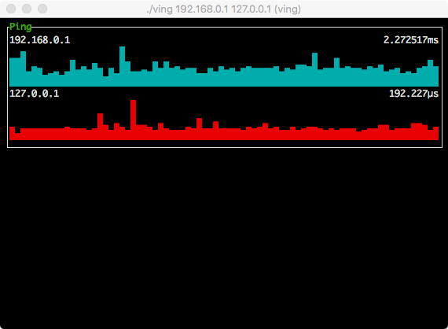
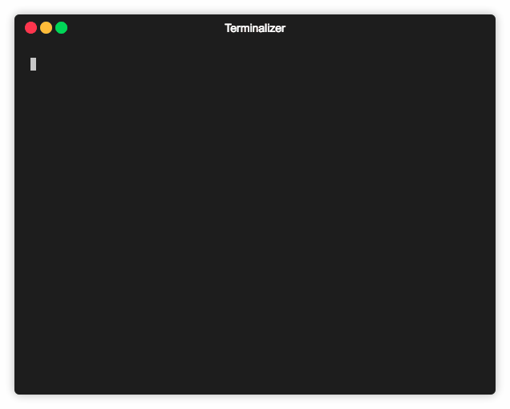

[](https://goreportcard.com/report/github.com/yittg/ving)

# 🐸 ving



`ving` is a ping utility with nice output, in Golang(1.11+), enhanced with some useful features,
like trace, ports probe, and more yet to be implemented, 😝.

Special thanks to the amazing [termui](https://github.com/gizak/termui) library.

# 🦁 Features

* ping multiple targets concurrently and independently;
* trace a target like a simple `tracerout`, `--trace`;
* probe well known tcp ports, `--ports`;
* error rate and latency statistics in sliding window, as emoji;
* sort by error rate and latency statistic, `--sort`;
* ping gateway conveniently, `-g`;
* responsive terminal display (based on termui).

## Feature details

| Features | Functionality | Details|
|----------|---------------|--------|
| Trace    | Toggle Key    | <kbd>t</kbd> |
|          | Switch        | <kbd>▲</kbd> / <kbd>k</kbd>, <kbd>▼</kbd> / <kbd>j</kbd> |
|          |               | <kbd>n</kbd>: manual mode |
|          |               | <kbd>c</kbd>: continuous mode |
| Ports    | Toggle Key    | <kbd>p</kbd> |
|          | Switch        | <kbd>▲</kbd> / <kbd>k</kbd>, <kbd>▼</kbd> / <kbd>j</kbd> |
|          |               | <kbd>v</kbd>: change view mode, name only, port number only, or both |
|          |               | <kbd>r</kbd>: refresh and probe all ports again |

# 🙈 Install

```
$ go get -u github.com/yittg/ving
```

> __Notes__ for linux users, run `ving` with `sudo` or `setcap` in advance, 
for more information, see the [man page](http://linux.die.net/man/7/capabilities).
>
>    ```
>    $ sudo setcap "cap_net_raw+ep" ving
>    ``` 

# ⚡ Usage

```
$ ving 192.168.0.1 127.0.0.1 8.8.8.8

$ ving --help
Usage: ving [options] target [target...]
for example: ving 127.0.0.1 192.168.0.1
             ving -i 100ms 192.168.0.1
  -g, --gateway             ping gateway
  -i, --interval duration   ping interval, must >=10ms (default 1s)
      --more-ports ints     add ports cares, e.g. 8080
      --ports               touch the target ports after start
      --sort                sort by statistic
  -t, --timeout duration    ping timeout, must >=10ms (default 1s)
      --trace               traceroute the target after start
  -v, --version             display the version
```

_A demo animation that demonstrates most of the functionality, although not perfectly rendered (see screenshot for actual rendering), thanks to [terminalizer](https://github.com/faressoft/terminalizer)._


