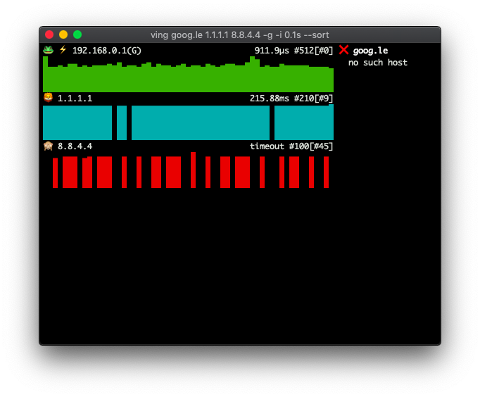
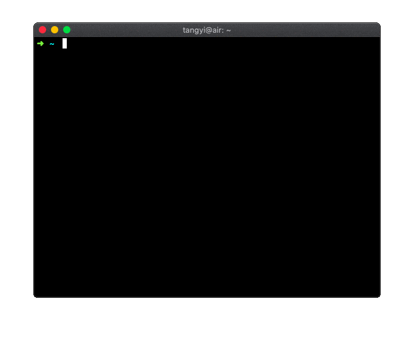

[](https://goreportcard.com/report/github.com/yittg/ving)

# 🐸 ving



`ving` is a ping utility with nice output, in Golang, with some useful and interesting features,
like trace, ports probe, and more yet to be implemented, 😝.

Special thanks to the amazing [termui](https://github.com/gizak/termui) library.



# 🦁 Features

* ping multiple targets concurrently and independently;
* trace a target like a simple `tracerout`, `--trace, -T`;
* probe well known tcp ports, `--ports`;
* error rate and latency statistics in sliding window, as emoji;
* sort by error rate and latency statistic, `--sort`;
* ping gateway conveniently, `-g`;
* plenty of configurations to customize;
* responsive terminal display (based on termui).


# 🙈 Installation

On macOS you can install or upgrade to the latest released version with [Homebrew](https://brew.sh/):
```
$ brew tap yittg/iyg

$ brew install ving

$ brew upgrade ving
```

Or you cat install via `go get`:
```
$ go get -u github.com/yittg/ving
```
And you can install the version in development(requires golang 1.11+):
```
$ go get -u github.com/yittg/ving@develop
```

> __Notes__ for linux users, run `ving` with `sudo` or `setcap` in advance, 
for more information, see the [man page](http://linux.die.net/man/7/capabilities).
>
>    ```
>    $ sudo setcap "cap_net_raw+ep" ving
>    ``` 

# ⚡ Usage

```
$ ving

$ ving 8.8.8.8 -P 1-1024

$ ving --help
```

## Key bindings

| Features | Keys         | Detail |
|----------|--------------|--------|
| Trace    | <kbd>t</kbd> | toggle traceroute |
|          | <kbd>▲</kbd> <kbd>▼</kbd> / <kbd>k</kbd> <kbd>j</kbd> | navigate |
|          | <kbd>n</kbd> | manual mode, i.e. next |
|          | <kbd>c</kbd> | continuous mode |
| Ports    | <kbd>p</kbd> | toggle ports probe |
|          | <kbd>▲</kbd> <kbd>▼</kbd> / <kbd>k</kbd> <kbd>j</kbd> | navigate |
|          | <kbd>f</kbd> | filter ports list, reached, unreached, or all |
|          | <kbd>v</kbd> | change view mode, name only, port number only, or both |
|          | <kbd>r</kbd> | refresh and probe all ports again |
| Help     | <kbd>h</kbd> | toggle help panel |
